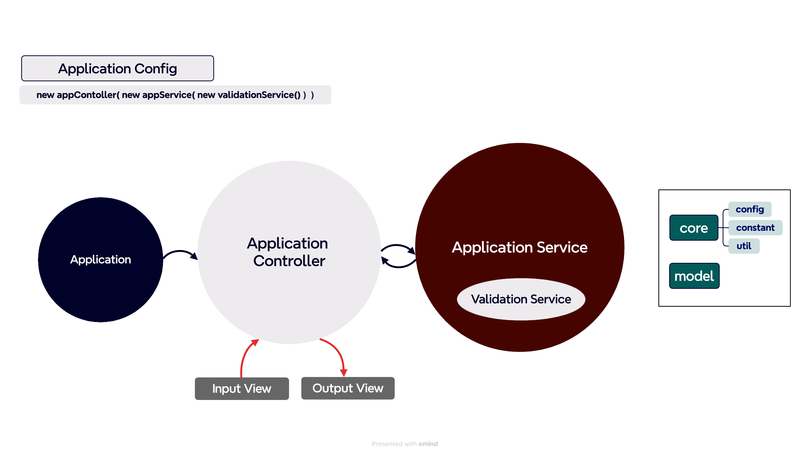

# ⚜️ 페어매칭관리 애플리케이션

# ⚜️ 기능 목록
미션을 함께 할 페어를 관리해주는 애플리케이션
- 같은 레벨 동안은 같은 페어를 만나지 않음
- 페어 매칭 기능
  - 조건
    - 미션을 함께 수행할 페어를 두명씩 매칭한다.
    - 페어 매칭 대상이 홀수인 경우 한 페어는 3인으로 구성한다.
    - 같은 레벨에서 이미 페어를 맺은 크루와는 다시 페어로 매칭될 수 없다.
  - 페어 매칭 구현 방법
    - 크루들의 이름 목록을 List<String> 형태로 준비한다.
    - 크루 목록의 순서를 랜덤으로 섞는다. 이 때 `camp.nextstep.edu.missionutils.Randoms`의 shuffle 메서드를 활용해야 한다.
    - 랜덤으로 섞인 페어 목록에서 페어 매칭을 할 때 앞에서부터 순서대로 두명씩 페어를 맺는다.
    - 홀수인 경우 마지막 남은 크루는 마지막 페어에 포함시킨다.
    - 같은 레벨에서 이미 페어로 만난적이 있는 크루끼리 다시 페어로 매칭 된다면 크루 목록의 순서를 다시 랜덤으로 섞어서 매칭을 시도한다.
    - 3회 시도까지 매칭이 되지 않거나 매칭을 할 수 있는 경우의 수가 없으면 에러 메시지를 출력한다.
  - 페어 재매칭 시도
    - 안내 문구를 출력 후 매칭을 진행한다.
    - 아니오를 선택할 경우 코스, 레벨, 미션을 다시 선택한다.
- 페어 조회 기능
  - 과정, 레벨, 미션을 선택하면 해당 미션의 페어 정보를 출력한다.
  - 매칭 이력이 없으면 매칭 이력이 없다고 안내한다.

# ⚜️ 예외 처리

- 기능의 종류 입력
  - 1,2,3,Q 를 제외한 나머지 입력이 들어왔을 경우
- 페어 조회 기능
  - 매칭 이력이 없을 경우

# ⚜️ 테스트
