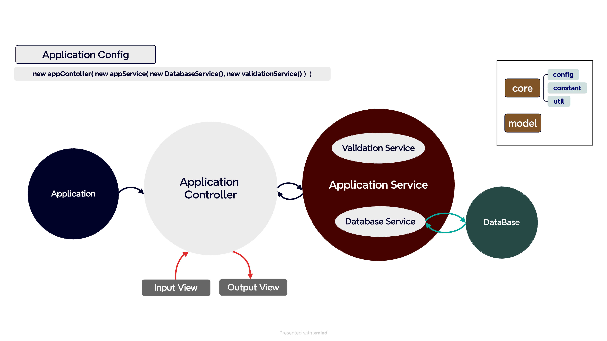

# ⚜️ 점심 메뉴 추천

# ⚜️ 기능 목록

한 주의 점심 메뉴를 추천해 주는 서비스
- 메뉴 추천 과정
  - 월 : 추천할 `카테고리` 무작위 선정
  - 각 코치가 월요일에 먹을 `메뉴 추천`
  - 화/수/목/금 : 앞의 두 과정을 반복
- 코치의 이름 : 2~4글자
- 2~5명까지 함께 식사
- 각 코치마다 0~2개의 못 먹는 메뉴 존재(,로 구분하여 입력)
  - 먹지 못하는 메뉴가 없으면 빈 값 입력
  - 추천을 못 하는 경우는 발생하지 않음
- 한 주(5일)에 같은 카테고리는 2회까지만 고를 수 있음
- 각 코치에게 한 주에 중복되지 않는 메뉴 추천해야
  - 예시
    - 구구: 비빔밥, 김치찌개, 쌈밥, 규동, 우동 → **한식을 3회 먹으므로 불가능**
    - 토미: 비빔밥, 비빔밥, 규동, 우동, 볶음면 → **한 코치가 같은 메뉴를 먹으므로 불가능**
    - 제임스: 비빔밥, 김치찌개, 스시, 가츠동, 짜장면 → **매일 다른 메뉴를 먹으므로 가능**
    - 포코: 비빔밥, 김치찌개, 스시, 가츠동, 짜장면 → **제임스와 메뉴가 같지만, 포코는 매번 다른 메뉴를 먹으므로 가능**
- 메뉴 추천 완료되면 프로그램 종료

### [ 입력 ]
- 코치 이름 입력
- 각 코치가 못 먹는 메뉴 입력
  - 못 먹는 음식은 빈 값 입력 (ex) 3명 -> 우동,스시라고 입력하면 마지막 사람은 못 먹는 음식이 없는 것

### [ 출력 ]
- 서비스 시작 문구
  - 점심 메뉴 추천을 시작합니다.
- 서비스 종료 문구 
  - 메뉴 추천 결과입니다. 
  [ 구분 | 월요일 | 화요일 | 수요일 | 목요일 | 금요일 ]
  [ 카테고리 | 한식 | 한식 | 일식 | 중식 | 아시안 ]
  [ 토미 | 쌈밥 | 김치찌개 | 미소시루 | 짜장면 | 팟타이 ]
  [ 제임스 | 된장찌개 | 비빔밥 | 가츠동 | 토마토 달걀볶음 | 파인애플 볶음밥 ]
  [ 포코 | 된장찌개 | 불고기 | 하이라이스 | 탕수육 | 나시고렝 ]  
  추천을 완료했습니다.
- 에러 문구 출력 : [ERROR] 로 시작해야 한다. 코치는 최소 2명 이상 입력해야 합니다.

# ⚜️ 예외 처리

### [ 입력 ]
- 코치 이름 입력 : 2~4 글자를 만족하지 않은 경우
- 먹지 못 하는 메뉴가 없으면 빈 값 입력해야 하는데 다른 것을 입력한 경우 
- 공백 입력 
- 코치 수가 2~5명 보다 적거나 많은 경우
- 못 먹는 메뉴가 0~2개 보다 많은 경우
- 카테고리가 같은 것이 3개 이상인 경우
- 중복되는 메뉴를 추천한 경우
- 못 먹는 메뉴를 추천한 경우

# ⚜️ 테스트
- 코치 이름을 정상을 입력한 경우 + 예외 처리
- 먹지 못하는 메뉴를 정상 입력한 경우 + 예외 처리
- 입력 자체를 공백으로 입력한 경우 예외 테스트
- 코치 수가 2~5명인 경우 + 예외 처리
- 못 먹는 메뉴가 0~2개인 경우 + 예외 처리
- 카테고리가 같은 것이 2개 이하인 경우 + 예외 처리
- 중복되는 메뉴가 없는 경우 + 예외 처리